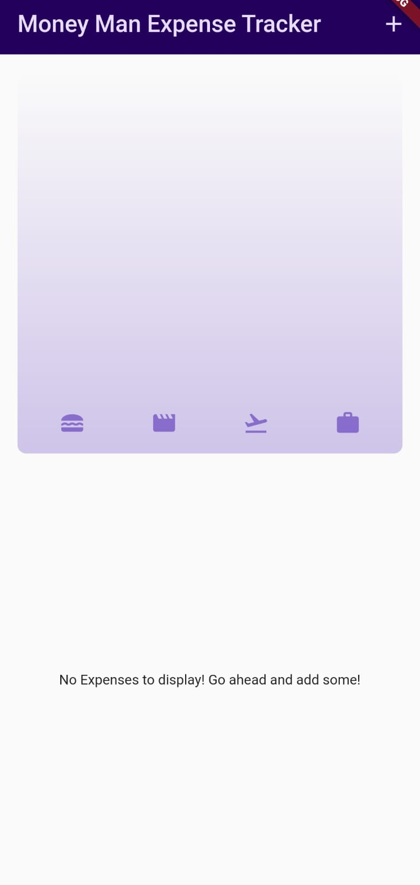
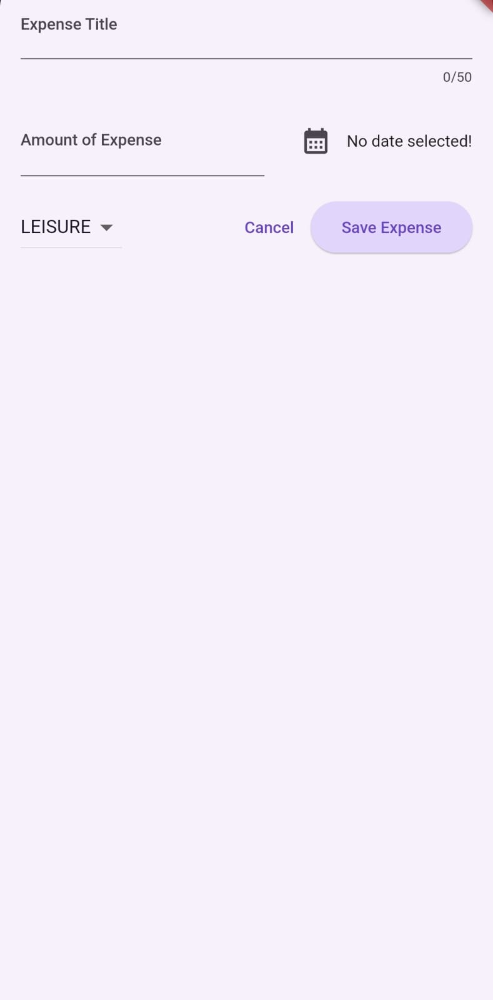
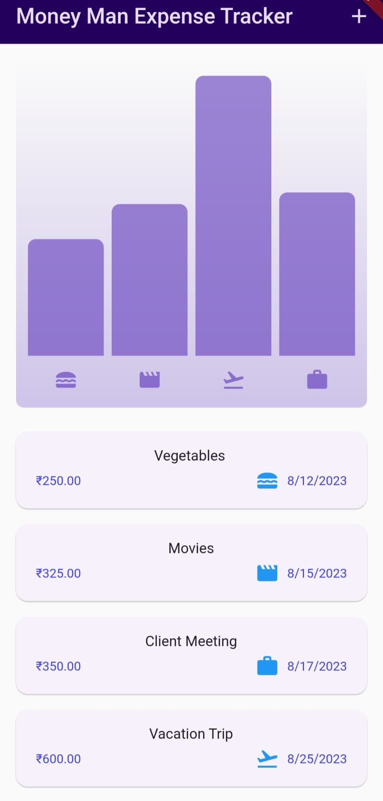

# Money Man Expenses Tracker
The Money Man Expenses Tracker App is a convenient tool for keeping track of your expenses. With this app, you can easily record the details of your expenditures, including the expense's name, category, and date. The app also provides you with an organized list of all your expenses, as well as a visual chart that illustrates the distribution of expenses across different categories.

## Getting Started
To get started with the Expenses Tracker App, follow these steps:

### 1.Clone the Repository: 
Clone this repository to your local machine using git clone.

### 2.Flutter Setup:
Make sure you have Flutter installed on your machine. If not, follow the official Flutter installation guide to set up Flutter.

### 3.Navigate to the Project Directory:
Open a terminal and navigate to the project directory using cd money_man_expenses-tracker-app.

### 4.Install Dependencies:
Run flutter pub get to install the app's dependencies.

## Working
### 1.Launch the App:
Run the app using flutter run from the project directory.

### 2.Recording Expenses:
Tap the "Add Expense" button to record a new expense. Enter the expense's name, select the category, and choose the date of the expense.

### 3.Viewing Expense List: 
Tap the "View Expenses" button to see a list of all recorded expenses. You can scroll through the list to review your past expenditures.

### 4.Expense Distribution Chart:
To visualize your spending patterns, navigate to the "Expense Chart" section. Here, you will find a chart displaying the relative distribution of expenses across different categories.

## Following Up the Expense
When you tap the "Add Expense" button, you'll be prompted to provide the following information about the expense:

### Expense Name:
Enter a brief description of the expense.
### Amount:
Enter the Amount you spent for that particular expense.
### Category:
Select the appropriate category for the expense (e.g., Food, Transportation, Entertainment, Bills, etc.).
### Date:
Choose the date when the expense was made.

## Expense Distribution Chart
The "Expense Chart" section provides you with a visual representation of your spending distribution across different categories. The chart helps you identify where your money is being allocated and which categories are taking up a significant portion of your expenses.

## Contributions
Contributions to the Expenses Tracker App are welcome! If you have ideas for new features, improvements to the user interface, or bug fixes, feel free to fork this repository and submit a pull request.

Expenses Tracker App
The Expenses Tracker App is a convenient tool for keeping track of your expenses. With this app, you can easily record the details of your expenditures, including the expense's name, category, and date. The app also provides you with an organized list of all your expenses, as well as a visual chart that illustrates the distribution of expenses across different categories.
